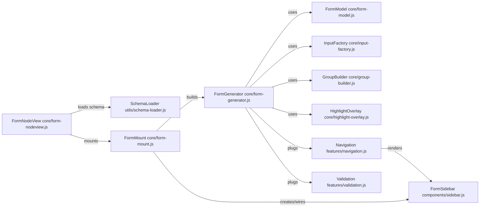

## Form UI Flows and Stacktraces

This document explains the runtime flows, class dependencies, responsibilities, state ownership, and stacktraces for the main user-visible behaviors:

- Rendering the form
- Rendering the sidebar
- Applying highlights (form and sidebar)
- Changing a field value
- Optional group activation (“+ Add …”)
- Validation and error badges
- Raw JSON mode
- Rendering strategy: `renderAllGroups`

### Module dependencies (high level)

### State ownership (by class)

- FormNodeView: `schema`, `data` (source-of-truth for ProseMirror content when serializing), `isRawMode` (when no schema). Delegates UI to the mount factory.
- mountFormUI (factory): `isRawMode` (view mode for the mounted form). Owns DOM wrapper and sidebar placement. Exposes API: `updateData`, `updateSchema`, `toggleRawMode`, `navigateTo`, `getData`, `destroy`.
- FormGenerator: `schema`, `model` (FormModel), `data`, `listeners`, `groupElements`, `navigationTree`, `fieldErrors`, `fieldSchemas`, `fieldElements`, `fieldToGroup`, `activeOptionalGroups`, `inputFactory`, `groupBuilder`, `highlightOverlay`, `renderAllGroups`.
- FormModel: `schema`; data helpers only (pure): `generateBaseJSON`, `get/ setNestedValue`, `deepMerge`, `getInputValue`.
- FormSidebar: `element`, `navigationTree`, `isCollapsed`, `currentMode`.
- Navigation (feature): depends on `FormGenerator`; no persistent state outside event handlers.
- Validation (feature): depends on `FormGenerator`; derives `groupIdsWithErrors` from `fieldErrors`.
- HighlightOverlay: `container`, `overlay`.

---

## Flow: Rendering the form

1) FormNodeView
   - parseContent() → resolves `{ schema, data }` (loads via `schema-loader` when needed)
   - finishInitialization() → calls mountFormUI({ mount, schema, data, onChange, onRemove })
   - State: `schema`, `data`

2) mountFormUI
   - Creates wrapper and host elements; creates `<pre><code>` for raw view
   - `generator = new FormGenerator(schema, { renderAllGroups })` → `generateForm()` → returns container
   - Appends code `<pre><code>` to the form container
   - Creates `sidebar = new FormSidebar()` and inserts inline under header
   - Wires mode toggle, remove, and navigation clicks to generator/navigation
   - Assigns `generator.navigationTree` and calls `navigation.generateNavigationTree()`
   - If initial data exists: `generator.loadData(data)`
   - State: `isRawMode` (factory), sidebar DOM

3) FormGenerator.generateForm()
   - Builds header, body, footer
   - `GroupBuilder.build(root)` creates groups/sections and maps `groupElements`
   - Attaches `HighlightOverlay`
   - After a tick: `navigation.mapFieldsToGroups()`, `ensureGroupRegistry()`, `navigation.generateNavigationTree()`, `validation.validateAllFields()`, then `updateData()` emits initial data
   - State: `data`, `groupElements`, `fieldSchemas`, `fieldElements`, `fieldToGroup`, `fieldErrors`

Stacktrace (key calls):
- FormNodeView.finishInitialization → mountFormUI → new FormGenerator → FormGenerator.generateForm → GroupBuilder.build → InputFactory.create (per field) → FormGenerator.updateData (async after render) → Validation.validateAllFields

---

## Flow: Rendering the sidebar

1) mountFormUI creates `FormSidebar` and inserts it inline under the header
2) generator.navigationTree = sidebar.getNavigationTree()
3) requestAnimationFrame → `Navigation.generateNavigationTree()`
   - Builds items by mirroring schema order with `Navigation.generateNavigationItems()` (includes nested object children under array items)
   - Adds section titles, Add-items for inactive optional `$ref`/array groups, and group items
   - Calls `Validation.refreshNavigationErrorMarkers()`
   - Enables hover and scroll sync
   - The inline sidebar panel limits height to the viewport and enables internal scrolling for large trees. Auto-floating is disabled; the panel stays inline.

Stacktrace:
- mountFormUI → sidebar.createElement → assign `navigationTree` → Navigation.generateNavigationTree → Navigation.generateNavigationItems → Validation.refreshNavigationErrorMarkers

State involved:
- FormGenerator: `groupElements`, `fieldToGroup`, `fieldErrors`, `navigationTree`
- FormSidebar: `isCollapsed`, `currentMode`

---

## Flow: Applying highlights (form and sidebar)

Trigger A: Click on a nav item
- Sidebar click → mount factory handler → `generator.navigation.navigateToGroup(groupId)`
- Navigation.navigateToGroup → `FormGenerator.highlightFormGroup(groupId)` → `HighlightOverlay.showFor(targetGroup)` → scroll to group → `Navigation.updateActiveGroup(groupId)` → `updateNavigationActiveState`

Trigger B: Hover/click within a form group
- Navigation.enableHoverSync attaches `mouseenter` and `click` handlers to `.form-ui-group`
- On hover: `updateNavigationActiveState(groupId)` moves the indicator bar
- On click: `FormGenerator.highlightFormGroup(groupId)` + `Navigation.updateActiveGroup(groupId)`

Trigger C: Focus an input
- InputFactory attaches `focus` → Navigation.highlightActiveGroup(inputEl) → `updateActiveGroup(groupId)`
- On `blur` with a delay, if no input is focused inside the active group → `Navigation.clearActiveGroupHighlight()`

Stacktrace (nav click):
- Sidebar.onNavigationClick → Navigation.onTreeClick → Navigation.navigateToGroup → FormGenerator.highlightFormGroup → HighlightOverlay.showFor → FormGenerator.scrollToFormGroup → Navigation.updateActiveGroup → Navigation.updateNavigationActiveState

State involved:
- FormGenerator: `groupElements`, `activeGroupId`, `navigationTree`
- HighlightOverlay: `overlay`

---

## Flow: Changing a field value

1) User types/changes an input
   - InputFactory common events: `input`/`change` → handler
   - Handler: `FormGenerator.updateData()` collects all named inputs into nested JSON using `FormModel.setNestedValue`
   - Then `Validation.validateField(fieldPath, schema, inputEl)` runs
   - Then listeners are notified (NodeView subscribed via `onChange`) and ProseMirror is updated

Stacktrace:
- DOM input event → InputFactory.onInputOrChange → FormGenerator.updateData → FormModel.generateBaseJSON → FormModel.deepMerge → FormModel.setNestedValue (per input) → Validation.validateField → Validation.refreshNavigationErrorMarkers (if needed) → listeners (NodeView.updateContent)

State involved:
- FormGenerator: `data`, `fieldSchemas`, `fieldElements`, `fieldErrors`, `listeners`
- FormModel: pure helpers

---

## Flow: Optional group activation (“+ Add …”)

1) Click on “+ Add …” in the sidebar
   - Navigation.onTreeClick detects `.form-ui-nav-item.form-ui-nav-item-add`
   - Derives schema path from `data-group-id="form-optional-…"`
   - Calls `FormGenerator.commandActivateOptional(path)` (command API)
     - Adds to `activeOptionalGroups`
     - Seeds `data` at path (`{}` for object; `[]` for array). For arrays-of-objects: if empty, auto-adds the first item (data-first) with a minimal default object (primitives, arrays, and required objects only)
     - Rebuilds body, regenerates navigation, runs validation
   - Navigates to the activated group or the first array item

Stacktrace:
- Sidebar click → Navigation.onTreeClick → FormGenerator.onActivateOptionalGroup → FormGenerator.rebuildBody → GroupBuilder.buildInline → Navigation.mapFieldsToGroups → FormGenerator.ensureGroupRegistry → FormGenerator.loadData → Navigation.generateNavigationTree → Validation.validateAllFields

State involved:
- FormGenerator: `activeOptionalGroups`, `data`, `groupElements`, `fieldSchemas`, `fieldElements`, `fieldToGroup`

---

## Flow: Validation and error badges

1) Initial pass after render & navigation
   - `Validation.validateAllFields()` iterates `fieldSchemas` and `fieldElements`, sets inline errors and populates `fieldErrors`
   - `refreshNavigationErrorMarkers()` marks nav items with `.has-error` and inserts an error triangle icon

2) On every field change or blur
   - `Validation.validateField()` sets/clears inline error and updates `fieldErrors`, then refreshes nav markers (unless skipped during batch)

3) After activation or array item add
   - A validation pass is scheduled on the next animation frame so required newly created inputs are marked immediately

Stacktrace:
- After render → Validation.validateAllFields → Validation.setFieldError → Validation.refreshNavigationErrorMarkers
- On change → Validation.validateField → Validation.setFieldError → Validation.refreshNavigationErrorMarkers

State involved:
- FormGenerator: `fieldErrors`, `fieldToGroup`, `navigationTree`

---

## Flow: Raw JSON mode (inspect‑only)

1) Mode toggle in sidebar
   - Sidebar.toggleMode → mount factory `toggleRaw()` → toggles `isRawMode`
   - Adds/removes `raw-mode` class on host; sets `<pre><code>` content to current `generator.getDataAsJSON()` and keeps it read-only
   - Updates header mode badge and sidebar icon/title

No parsing is performed when leaving raw mode; the form remains the source of truth for edits.

Stacktrace:
- Sidebar.onModeToggle → mount.toggleRaw → generator.getDataAsJSON → sidebar.setMode → header badge update

State involved:
- Factory: `isRawMode`
- FormGenerator: `data`
- Sidebar: `currentMode`

---

## Notes on arrays

- Arrays of primitives: created via `InputFactory.createArrayInput()`; each item is an input.
  - When empty, one blank input is rendered by default.
  - The Add button is disabled until the last rendered item has a non-empty value.
  - Delete for the single blank item is hidden using `visibility: hidden` to keep layout stable; two‑step confirmation on other items.
  - On data collection, empty strings are pruned; an empty array serializes as `[]`.
  - Add/remove are data-first via `FormModel` through generator wiring.
- Arrays of objects: rendered as nested `form-ui-group` with an internal array UI; nav item points to this group. Nested object children within an array item are listed under the item in the sidebar. Add/remove/reorder are data-first via command API.

---

## Rendering strategy: `renderAllGroups`

- `renderAllGroups: false` (default)
  - Optional object/array groups are not rendered until activated via the sidebar.
  - Base data includes required object subtrees and always includes array keys as `[]`.
  - After activation and after array-item add, validation runs post-nav to flag required fields.

- `renderAllGroups: true`
  - Optional object/array groups render recursively by default, except optional object children inside array items remain inactive until explicitly activated or data exists.
  - Base data includes all objects/arrays; arrays initialized to `[]`.
  - When an optional array-of-objects is activated (via sidebar), one item is auto-added if the array is empty (data-first).
  - The sidebar lists nested object children under array items.
  - Base JSON generation is cycle-safe via a `$ref` seen-set.

---

## Data-first rules for all flows

- Always: `updateData()` → mutate JSON via `FormModel` or command API → `rebuildBody()` → regenerate navigation → `validateAllFields()`.
- Derive navigation items and counts from JSON (not DOM), and use path→ID helpers.
- Keep optional nested objects under array items inactive by default (unless required or data exists).

### Flow checklist when adding/changing behavior

- Mutations go through command API? (activate/add/remove/reorder/reset)
- Rebuild + validate scheduled in proper order?
- Navigation and IDs updated using helpers?
- Optional children remain gated appropriately?
- README/README-FLOW updated when semantics change?

