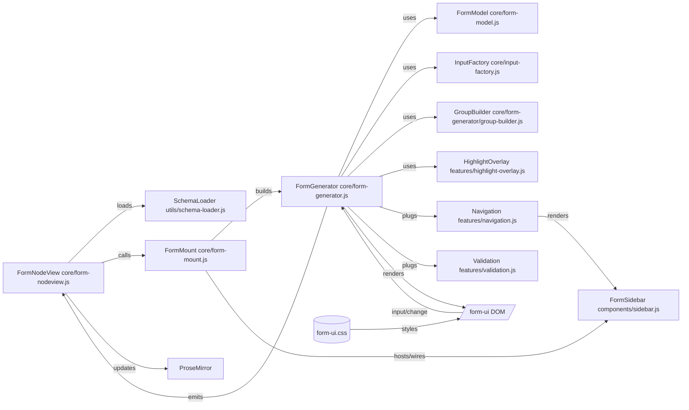

## Form UI (JSON Schema–driven)

This README documents the form-ui architecture: how JSON Schema turns into a form, how the sidebar, navigation, validation and visual effects are wired, and where to extend the system. It reflects the current separation of concerns (core/features/components/utils) and preserves the existing DOM and CSS contracts.

### At a glance



### Data-driven strategy (TL;DR)

- **Single source of truth**: Schema (shape, labels, validation) + JSON data (mutable app state).
- **Render from schema+data only**: Form content and sidebar/navigation must be derived from the schema and current data; avoid DOM-driven structure.
- **Mutations go through commands**: All add/remove/reorder/activate/reset use `FormGenerator` commands which mutate JSON via `FormModel`, then rebuild and validate.
- **Arrays-of-objects defaults are minimal**: When adding an item, include primitives, arrays, and required nested objects. Optional nested objects (e.g., `link`) are omitted until explicitly activated or data exists.
- **`renderAllGroups` nuance**: Even when true, optional object children inside array items remain gated (to avoid overwhelming new items) unless required or present in data.
- **Navigation is schema+data-driven**: Sidebar item counts and child listings come from data (no DOM counting). IDs use path→ID helpers. Sidebar scroll position is preserved across re-renders.
- **Validation runs post-rebuild**: After any structural change, validate on the next frame so required states are immediately visible.
- **Path/ID helpers**: Centralized helpers build stable IDs and compare/escape paths consistently.
- **Primitive arrays are pruned**: Empty strings are removed when collecting data; an empty primitive array serializes as `[]`, not `[""]`.

Key APIs:
- `FormModel`: `generateBaseJSON`, `get/setNestedValue`, `deepMerge`, `pushArrayItem`, `removeArrayItem`, `reorderArray`, `ensureObjectAtPath`.
- `FormGenerator`: `commandActivateOptional`, `commandAddArrayItem`, `commandRemoveArrayItem`, `commandReorderArrayItem`, `commandResetAll`, plus `pathToGroupId`, `arrayItemId`.

### Directory roles

- Core: orchestration and rendering pipeline
  - `core/form-nodeview.js`: ProseMirror integration; parses `{ schema, data }`, mounts via the factory, serializes back to the document. It no longer creates or manages the sidebar directly.
  - `core/form-mount.js`: factory that mounts the form UI into a DOM node. Builds `FormGenerator`, creates and wires `FormSidebar`, handles raw JSON mode, and exposes a tiny API. Supports UI options (see Factory API).
  - `core/form-generator.js`: orchestrates schema→DOM, data updates, and hooks features.
  - `core/form-generator/path-utils.js`: stable path→id helpers (`hyphenatePath`, `pathToGroupId`, `arrayItemId`).
  - `core/form-generator/schema-utils.js`: schema deref/normalization/title/base JSON helpers (pure, cycle-safe).
  - `core/form-generator/input-array-group.js`: arrays-of-objects rendering logic (factored from generator).
  - `core/form-generator/placeholders.js`: creates unified “Add …” placeholder blocks.
  - `core/form-model.js`: pure data helpers (base JSON from schema, deep merge, nested set, input coercion).
  - `core/input-factory.js`: composes input subclasses and creates inputs for schema types; attaches standard events.
  - `core/inputs/base-input.js`, `core/inputs/{text,textarea,select,number,checkbox}-input.js`: individual input implementations.
  - `core/form-generator/group-builder.js`: builds `.form-ui-section` and `.form-ui-group` recursively with stable IDs.

- Features: pluggable behaviors with no DOM structure ownership
  - `features/navigation.js`: builds/updates sidebar navigation; active/hover sync and indicator bar. Includes nested object children under array items and bracket-aware IDs.
  - `features/validation.js`: inline field validation + sidebar error markers (JSON‑Schema style checks).

- Components: reusable UI widgets
  - `components/sidebar.js`: the right-side panel (collapse, mode toggle, remove) with delegated event API.

- Utils: cross‑cutting helpers
  - `utils/schema-loader.js`: fetches/caches `*.schema.json` from a configured repo/branch.
  - `utils/icons.js`: SVG providers.
  - `utils/dom-utils.js`: shared DOM helpers. Currently exports `getControlElement(node)` which returns either the node itself (if it is an `input|select|textarea`) or the first such descendant. Used by `FormGenerator` to consistently resolve the control element from containers like checkbox/array wrappers.

### Lifecycle

1) Parse block content in `FormNodeView`
   - Accepts `{ schema: "name|inline", data: {...} }` or raw JSON object.
   - Loads schema via `schema-loader` unless `inline`, then infers a basic schema.

2) Create UI
   - `FormNodeView` calls the factory `mountFormUI({ mount, schema, data, onChange, onRemove })`.
   - The factory builds `FormGenerator` and `FormSidebar`, inserts the panel inline under the header, wires nav/tabs, and manages raw/form mode.
   - The `<pre><code>` raw JSON node lives inside the container and is toggled by the factory.

3) Generate DOM from schema in `FormGenerator`
   - Initial render: `generateForm()` uses `GroupBuilder.build()` to create groups (with primitive fields) and sections (containers without primitives).
   - Dynamic updates: `rebuildBody()` uses `GroupBuilder.buildInline()` to rebuild the body in-place (e.g., after activating optional `$ref`/array groups), preserving schema order.
   - Arrays of objects (including `$ref` items) render as their own nested `form-ui-group` at the property position.
   - `InputFactory` creates controls and wires input/change/focus/blur to update data, validate, and highlight group.
   - `FormModel` maintains data shape and nested setting logic.
   - `Navigation.generateNavigationTree()` mirrors groups/sections in the sidebar in the same property order, placing optional inactive `$ref`/array groups as in-place “Add …” items. It includes nested object children under array items.
   - `Validation.validateAllFields()` runs after render and nav rebuild so required/invalid states are visible on load. It also runs after optional group activation and after array‑item add.

4) Sync back to ProseMirror
   - On any change, `FormGenerator` emits new `data` → `FormNodeView` replaces the code_block text with `{ schema, data }` JSON.
   - Raw JSON mode is toggled by the factory and is inspect‑only; switching back does not parse JSON into the form.

### DOM contract (stable IDs/classes)

- Group IDs: `form-group-<path>` where the path uses dot/bracket notation normalized by replacing any `[`, `]`, and `.` with `-`.
  - Examples:
    - Object: `pricing.bulkPricing.tier1` → `form-group-pricing-bulkPricing-tier1`
    - Array item: `tutorialList[0].link` → `form-group-tutorialList-0--link`
- Section IDs: `form-section-<path.with.dots>`.
- Field container carries `data-field-path` with the dot path.
- Sidebar nav items mirror these IDs via `data-group-id` and carry `data-level` for indentation.
- All CSS in `form-ui.css` relies on the above; the implementation maintains exact markup/class names.

### `$ref`/`$defs` resolution (on-demand)

- The generator performs shallow, on-demand dereferencing via `FormGenerator.derefNode(node)`.
- Only local `$ref` paths (e.g. `#/$defs/...`) are resolved when the node is accessed. The full schema is not pre-expanded to avoid deep recursion and stack overflows.
- `normalizeSchema()` is used wherever node access occurs to ensure unions and `$ref` are dereferenced just enough for rendering/typing decisions.

### How content is built (inline, ordered)

- `GroupBuilder.buildInline(container, schema, breadcrumbPath, schemaPath)` renders children in the exact order of `schema.properties`.
- For each property:
  - Primitive types render as fields inside the current group container.
  - Object types render as nested groups inline. If the object has no primitives at that level, a section header is added and children are rendered beneath it.
  - Arrays of objects (including `$ref` items) render as their own nested `form-ui-group` inline at the property position.
  - Optional `$ref` objects and arrays-of-objects are skipped in content until activated; required ones always render.

### How the sidebar is built (ordered, in-place Add)

- `Navigation.generateNavigationItems(schema, path, level)` iterates `properties` in declaration order and mirrors the structure:
  - If the current level contains primitive fields, it adds a nav item for the current group (`form-group-…`).
  - Primitive child properties are not individually listed in the nav; they belong to the parent group.
  - For each child property in order:
    - Optional inactive `$ref` or arrays-of-objects: render an in-place, indented “Add <Title>” item with `data-group-id="form-optional-…"`.
    - Active arrays-of-objects: render a clickable group item (`data-group-id="form-group-…"`), then one item per existing array entry. For each array item, nested object children (e.g., `link`, `dataRef`, `questionnaire`) are included under the item.
    - Object types: if they have no primitives but have children, render a section header (`form-section-…`) at the same indentation; then recurse into children.
- Indentation is controlled by `data-level` and the CSS custom property `--nav-level` on `.form-ui-nav-item-content`.
- Error badges are applied post-render by Validation; the indicator is positioned on the right and doesn’t interfere with clicks.
- Scroll position: `Navigation.generateNavigationTree()` preserves sidebar `scrollTop` across re-renders.

### What happens when clicking “+ Add …” in the sidebar

1) Delegated click handler in `features/navigation.js` catches clicks on `.form-ui-nav-item.form-ui-nav-item-add`.
2) It derives the schema path from `data-group-id` (`form-optional-…`) and resolves the corresponding node from the root schema.
3) `FormGenerator.commandActivateOptional(path)` (central command) is used to activate and seed data:
   - Adds `path` to `activeOptionalGroups`.
   - Seeds `data` at that path based on type:
     - Object → base object tree (arrays initialized to `[]`). Optional nested objects are omitted unless required or already present in data. This applies even when `renderAllGroups` is true for children inside array items.
     - Array → initializes `[]`. For arrays-of-objects, if the array is empty, the first item is auto-added (data-first) using a default object that includes primitives/arrays and required nested objects only.
   - Emits updated `data`, rebuilds the form body (`rebuildBody()`), regenerates navigation, and validates.
4) Navigation then scrolls to the activated group or the first array item.

### Rendering strategy: renderAllGroups

- The mount factory accepts `ui.renderAllGroups: boolean` to control optional group rendering and base data shaping.
  - When `false` (default):
    - Optional object/array groups do not render until activated via the sidebar.
    - Base data includes required object subtrees and always includes array keys as `[]`.
    - Validation runs after activation/array item add to flag required fields immediately.
  - When `true`:
    - Optional object/array groups render recursively by default, except optional object children inside array items which remain inactive until explicitly activated or data exists for them (prevents overwhelming newly added array items).
    - Base data includes all nested objects and arrays present in the schema (arrays initialized to `[]`).
    - Arrays-of-objects may auto-add a first item when activated from the sidebar (data-first rule).
    - Navigation lists nested object children under array items.

### State tracking (form content and sidebar)

- `activeOptionalGroups: Set<string>` (FormGenerator): activated optional groups (object or array). Inactive optional groups remain hidden in content and appear as “Add …” in the sidebar.
- `data: object` (FormGenerator): current JSON payload. Updated via `updateData()` and via `onActivateOptionalGroup()` when seeding new groups.
- `FormModel.generateBaseJSON(schema)`: initial data tree for any object node. Arrays always exist as `[]`; optional objects are created only when required or activated.
- `FormModel.setNestedValue(obj, path, value)`: supports dot and bracket notation (e.g., `array[0].prop`). Creates objects/arrays as needed.
- `FormModel.deepMerge(base, incoming)`: preserves keys present in `incoming` while merging into existing state to avoid losing dynamically added optional branches.
- `groupElements: Map<groupId, { element, path, title, isSection }>` (FormGenerator): rebuilt on each render and used by navigation, hover/scroll sync, validation, and scrollspy.
- `fieldSchemas`, `fieldElements`, `fieldErrors` (FormGenerator): typing and validation state per field.
- `fieldToGroup: Map<fieldPath, groupId>` (FormGenerator): links fields to their group container for navigation and error mapping.
- `isCollapsed`, `currentMode` (FormSidebar): panel UI state.
- `isRawMode` (mount factory): current visual mode for the form container; raw is inspect‑only.

### Arrays (multi-value fields)

- Array fields always exist in the JSON (`[]`) even when empty. With `renderAllGroups: true`, optional arrays are also present as empty arrays by default.
- Inputs inside array items are named using bracketed indices (e.g., `tutorialList[0].title`) so `updateData()` can map them back correctly.
- Removing an item reindexes subsequent UI inputs; state is re-collected on next `updateData()`.
- Arrays of objects render as nested groups; their nav items are clickable and scroll to the array’s group container. Adding/removing/reordering is data-first (mutations via `FormModel`), then the UI rebuilds.
- Arrays of primitives render via `InputFactory.createArrayInput()` as a compact repeatable input list.
  - When empty, one blank input is rendered by default.
  - The Add button is disabled until the last rendered item has a non-empty value.
  - Removing the only blank item hides the delete button (layout preserved with `visibility: hidden`).
  - Deletion uses a two-step confirmation (trash → check) with consistent icon sizing; after confirm, removal is delegated to the command API.
  - Collected JSON prunes empty strings from primitive arrays; empty results serialize as `[]`.

#### Data-first mutation API

- `FormModel` exposes centralized mutations used by the generator and UI handlers:
  - `pushArrayItem(data, arrayPath, newItem)`
  - `removeArrayItem(data, arrayPath, index)`
  - `reorderArray(data, arrayPath, fromIndex, toIndex)`
  - `ensureObjectAtPath(data, path, objectSchema)`
- `FormGenerator` exposes command wrappers:
  - `commandActivateOptional(path)`
  - `commandAddArrayItem(arrayPath)`
  - `commandRemoveArrayItem(arrayPath, index)`
  - `commandReorderArrayItem(arrayPath, fromIndex, toIndex)`
  - `commandResetAll()`

All UI actions call these commands, which: `updateData()` → mutate JSON via `FormModel` → `rebuildBody()` → validate.

### Positioning and visuals (CSS)

- Sidebar tabs remain a fixed vertical strip; expanding opens the content panel to the right.
- `.form-side-panel.form-inline-panel` is sticky and right-aligned (negative right margin). The panel limits height to the viewport and enables internal scrolling for the navigation tree. Auto-floating is disabled; it stays inline.
- Reset button (optional) shows a red confirm state before performing the reset.
- `.form-ui-highlight-overlay` is an absolute 2px bar placed along the left edge of the form container; `HighlightOverlay` computes top/height.
- Smooth scrolling to groups is enabled via `.form-ui-body { scroll-behavior: smooth; }`.
- Add placeholders: optional groups and array add-actions share a unified placeholder style (`.form-ui-placeholder-add`), full-width and hover-highlighted; disabled buttons show reduced opacity and not-allowed cursor.

### Public maps/refs other modules use

`core/form-generator.js` exposes these fields for features:

- `groupElements`: Map of `groupId → { element, path, title, isSection? }`.
- `fieldSchemas`: Map of `fieldPath → schema`.
- `fieldElements`: Map of `fieldPath → controlElement`.
- `fieldToGroup`: Map of `fieldPath → groupId`.
- `navigationTree`: HTMLElement assigned to the sidebar’s `.form-navigation-tree`.

These are considered part of the internal contract that `features/navigation.js` and `features/validation.js` depend on.

### Code documentation

- All core, features, and component classes are documented with JSDoc at class level and for their primary methods. Highlights:
  - `core/form-nodeview.js`: parsing `{ schema, data }`, mounting via the factory, serializing back to the document. Sidebar creation lives in the factory.
  - `core/form-generator.js`: data/model/generation lifecycle and the responsibilities of each helper.
  - `core/input-factory.js`, `core/group-builder.js`, `core/highlight-overlay.js`, `core/form-model.js`: single responsibilities and return types.
  - `features/navigation.js` and `features/validation.js`: public APIs.
  - `components/sidebar.js`: component API (`onModeToggleHandler`, `onRemoveHandler`, `onNavigationClickHandler`, `setCollapsed`, `setMode`).
  - `core/form-mount.js`: factory API and responsibilities.

You can generate API documentation with any JSDoc tooling if desired; the code comments are written to be compatible with standard JSDoc parsers.

### How to extend

- Add a control type
  1) Implement creation in `core/input-factory.js` (`create…Input`).
  2) Return the control element or container with a single focusable control inside.
  3) The factory attaches events via the injected callbacks from `FormGenerator`.

- Add a behavior (feature)
  1) Create a module in `features/` that takes `formGenerator` as a dependency.
  2) Read the public maps/refs listed above; do not mutate DOM structure directly.
  3) Instantiate the feature in `FormGenerator`’s constructor (similar to `Navigation` and `Validation`).

- Change grouping/sections
  - Update `core/group-builder.js`. Keep group/section ID rules intact for sidebar parity.

- Change data shaping
  - Update `core/form-model.js` (base JSON, deepMerge, setNestedValue).

### Developer checklist (before merging changes)

- **Data-first?** Does every structural change (activate/add/remove/reorder/reset) mutate JSON through the command API and then rebuild/validate?
- **Schema+data only?** Are new UI decisions based on schema/data (not DOM queries)?
- **Optional children**: For array items, are optional nested objects left out by default and only rendered when required or activated?
- **ID/path consistency**: Are IDs generated via `pathToGroupId/arrayItemId` and paths escaped consistently?
- **Validation timing**: After structural updates, is `validateAllFields()` scheduled post-rebuild?
- **Navigation parity**: Does the sidebar reflect the full nested structure based on data (no duplicate entries, no missing children)?
- **Docs**: If you changed behavior (activation, defaults, renderAllGroups semantics), did you update README/README-FLOW?

### Common pitfalls (avoid these)

- Triggering DOM clicks to create items (causes loops); mutate data then rebuild instead.
- Counting DOM nodes to derive array sizes; read from JSON (`FormModel.getNestedValue`).
- Auto-including optional nested objects under array items on add; keep defaults minimal.
- Updating IDs/paths by ad-hoc regex in multiple places; use the centralized helpers.

### Raw JSON mode (inspect‑only)

- Clicking the mode toggle switches between form view and raw JSON view.
- In raw view, `<pre><code>` shows the current `data` as JSON (with the active `schema` preserved by `FormNodeView` when serializing), and is not editable.
- Switching back does not parse JSON back into the form. Use `api.updateData(next)` to update programmatically or edit fields in the form.

### Error handling and markers

- `Validation.getValidationError()` performs basic checks: required, min/max, regex, enum, formats (email/url).
- Inline errors appear in `.form-ui-error` after the control and add `.invalid` to the control.
- Sidebar error badges: groups with any error are marked with `.has-error` and an inline SVG triangle icon positioned by `--nav-level`.

### Testing suggestions

- Snapshot the generated DOM for a representative schema (see `html-structure.html`) to guard IDs/classes and group/section layout.
- Unit test `FormModel` (deepMerge, setNestedValue) and `GroupBuilder` (ID formation and section vs group decisions).
- Unit test `InputFactory` required flag propagation and focus/blur highlighting hooks.

### Troubleshooting

- Sidebar opens but buttons shift: ensure sidebar DOM contains both `.form-side-panel-main` and `.form-side-panel-tabs` (the component now does).
- First click does nothing after page load: NodeView calls `sidebar.setCollapsed(true)` to sync internal state with the DOM. If customized, keep the DOM class and component state aligned.

### File map

- Core: `core/form-nodeview.js`, `core/form-mount.js`, `core/form-generator.js`, `core/form-generator/path-utils.js`, `core/form-generator/schema-utils.js`, `core/form-generator/input-array-group.js`, `core/form-generator/placeholders.js`, `core/form-model.js`, `core/input-factory.js`, `core/inputs/*`, `core/form-generator/group-builder.js`
- Features: `features/navigation.js`, `features/validation.js`, `features/highlight-overlay.js`
- Components: `components/sidebar.js`
- Utils: `utils/schema-loader.js`, `utils/icons.js`
- Styles: `form-ui.css`

### Factory API (core/form-mount.js)

```js
const api = mountFormUI({
  mount,        // HTMLElement to render into
  schema,       // JSON schema object
  data,         // initial data object
  onChange,     // (data) => void, called on every change
  onRemove,     // () => void, called when delete confirmed
  ui: {
    showRemove: true,        // hides remove button when false (also supported as legacy top-level showRemove)
    fixedSidebar: false,     // when true, sidebar stays expanded inline (no collapse control)
    renderAllGroups: false,  // when true, render optional object/array groups recursively and include arrays as [] in base data
    showReset: false,        // when true, shows a reset button (with confirm); resets data and rebuilds
  },
});

api.updateData(next);            // replace form data
api.updateSchema(nextSchema);    // rebuild with a new schema
// Raw mode removed: no toggleRawMode API
api.navigateTo(groupId);         // navigate to group id
api.getData();                   // read current data
api.destroy();                   // unmount
```


