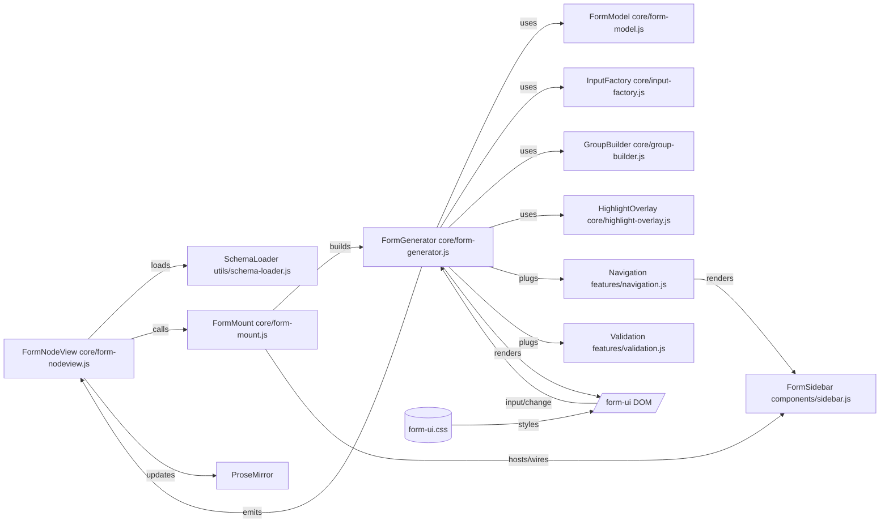

## Form UI (JSON Schema–driven)

This README documents the form-ui architecture: how JSON Schema turns into a form, how the sidebar, navigation, validation and visual effects are wired, and where to extend the system. It reflects the current separation of concerns (core/features/components/utils) and preserves the existing DOM and CSS contracts.

### At a glance



### Directory roles

- Core: orchestration and rendering pipeline
  - `core/form-nodeview.js`: ProseMirror integration; parses `{ schema, data }`, mounts via the factory, serializes back to the document. It no longer creates or manages the sidebar directly.
  - `core/form-mount.js`: factory that mounts the form UI into a DOM node. Builds `FormGenerator`, creates and wires `FormSidebar`, handles raw JSON mode, and exposes a tiny API.
  - `core/form-generator.js`: orchestrates schema→DOM, data updates, and hooks features.
  - `core/form-model.js`: pure data helpers (base JSON from schema, deep merge, nested set, input coercion).
  - `core/input-factory.js`: creates inputs for schema types and attaches standard events.
  - `core/group-builder.js`: builds `.form-ui-section` and `.form-ui-group` recursively with stable IDs.
  - `core/highlight-overlay.js`: renders the blue vertical overlay for highlighted groups.

- Features: pluggable behaviors with no DOM structure ownership
  - `features/navigation.js`: builds/updates sidebar navigation; active/hover sync and indicator bar.
  - `features/validation.js`: inline field validation + sidebar error markers (JSON‑Schema style checks).

- Components: reusable UI widgets
  - `components/sidebar.js`: the right-side panel (collapse, mode toggle, remove) with delegated event API.

- Utils: cross‑cutting helpers
  - `utils/schema-loader.js`: fetches/caches `*.schema.json` from a configured repo/branch.
  - `utils/icons.js`: SVG providers.
  - `utils/dom-utils.js`: shared DOM helpers. Currently exports `getControlElement(node)` which returns either the node itself (if it is an `input|select|textarea`) or the first such descendant. Used by `FormGenerator` to consistently resolve the control element from containers like checkbox/array wrappers.

### Lifecycle

1) Parse block content in `FormNodeView`
   - Accepts `{ schema: "name|inline", data: {...} }` or raw JSON object.
   - Loads schema via `schema-loader` unless `inline`, then infers a basic schema.

2) Create UI
   - `FormNodeView` calls the factory `mountFormUI({ mount, schema, data, onChange, onRemove })`.
   - The factory builds `FormGenerator` and `FormSidebar`, inserts the panel inline under the header, wires nav/tabs, and manages raw JSON mode.
   - The `<pre><code>` raw JSON node lives inside the container and is toggled by the factory.

3) Generate DOM from schema in `FormGenerator`
   - `GroupBuilder` builds the form inline and in order using `buildInline()`. It splits objects into groups (primitives) and sections (containers without primitives), and renders array-of-object references as nested groups inline at their schema position.
   - `InputFactory` creates controls and wires input/change/focus/blur to update data, validate, and highlight group.
   - `FormModel` maintains data shape and nested setting logic.
   - `Navigation.generateNavigationTree()` mirrors groups/sections in the sidebar in the same property order, placing optional inactive `$ref`/array groups as in-place “Add …” items.
   - `Validation.validateAllFields()` runs once post-render so required/invalid states are visible on load.

4) Sync back to ProseMirror
   - On any change, `FormGenerator` emits new `data` → `FormNodeView` replaces the code_block text with `{ schema, data }` JSON.
   - Raw JSON mode is toggled by the factory; on switch back it parses JSON and updates the form.

### DOM contract (stable IDs/classes)

- Group IDs: `form-group-<path.with.dots>` → hyphenated (e.g. `pricing.bulkPricing.tier1` → `form-group-pricing-bulkPricing-tier1`).
- Section IDs: `form-section-<path.with.dots>`.
- Field container carries `data-field-path` with the dot path.
- Sidebar nav items mirror these IDs via `data-group-id` and carry `data-level` for indentation.
- All CSS in `form-ui.css` relies on the above; the implementation maintains exact markup/class names.

### `$ref`/`$defs` resolution (on-demand)

- The generator performs shallow, on-demand dereferencing via `FormGenerator.derefNode(node)`.
- Only local `$ref` paths (e.g. `#/$defs/...`) are resolved when the node is accessed. We do not pre-expand the full schema to avoid deep recursion and stack overflows with large or recursive schemas.
- `normalizeSchema()` is used wherever node access occurs to ensure unions and `$ref` are dereferenced just enough for rendering/typing decisions.

### How content is built (inline, ordered)

- `GroupBuilder.buildInline(container, schema, breadcrumbPath, schemaPath)` renders children in the exact order of `schema.properties`.
- For each property:
  - Primitive types render as fields inside the current group container.
  - Object types render as nested groups inline. If the object has no primitives at that level, a section header is added and children are rendered beneath it.
  - Arrays of objects (including `$ref` items) render as their own nested `form-ui-group` inline at the property position.
  - Optional `$ref` objects and arrays-of-objects are skipped in content until activated; required ones always render.

### How the sidebar is built (ordered, in-place Add)

- `Navigation.generateNavigationItems(schema, path, level)` iterates `properties` in declaration order and mirrors the structure:
  - If the current level contains primitive fields, it adds a nav item for the current group (`form-group-…`).
  - Primitive child properties are not individually listed in the nav; they belong to the parent group.
  - For each child property in order:
    - Optional inactive `$ref` or arrays-of-objects: render an in-place, indented “Add <Title>” item with `data-group-id="form-optional-…"`.
    - Active arrays-of-objects: render a clickable group item (`data-group-id="form-group-…"`).
    - Object types: if they have no primitives but have children, render a section header (`form-section-…`) at the same indentation; then recurse into children.
- Indentation is controlled by `data-level` and the CSS custom property `--nav-level` on `.form-ui-nav-item-content`.
- Error badges are applied post-render by Validation; the indicator is positioned on the right and doesn’t interfere with clicks.

### What happens when clicking “+ Add …” in the sidebar

1) Delegated click handler in `features/navigation.js` catches clicks on `.form-ui-nav-item.form-ui-nav-item-add`.
2) It derives the schema path from `data-group-id` (`form-optional-…`) and resolves the corresponding node from the root schema.
3) `FormGenerator.onActivateOptionalGroup(path, schemaNode)` is called:
   - Adds `path` to `activeOptionalGroups`.
   - Seeds `data` at the path with a base value derived from the node type:
     - Object → `FormModel.generateBaseJSON(node)` ensures all child arrays are present as `[]`.
     - Array → `[]` (empty array); the UI will immediately add the first item if the property is an array of objects.
   - Emits the updated `data` to subscribers.
   - Calls `rebuildBody()` which clears and rebuilds the form body inline, remaps groups/fields, restores data values, revalidates, and regenerates the navigation.
4) If the activated node is an array-of-objects, the handler emulates one click on the array’s “add item” control to pre-create the first item.
5) Finally, navigation is regenerated and the UI scrolls to the newly created group.

### State tracking (form content and sidebar)

- `activeOptionalGroups: Set<string>` tracks which optional groups (object or array) have been activated. Optional groups not present in this set remain hidden in content and appear as “Add …” in the sidebar.
- `data: object` is the current JSON payload. It is updated via `updateData()` collecting field values and `FormModel.setNestedValue`, and via `onActivateOptionalGroup()` when seeding new groups.
- `FormModel.generateBaseJSON(schema)` constructs the initial data tree for any object node, ensuring arrays exist as `[]` even when empty so their keys are emitted in JSON.
- `FormModel.setNestedValue(obj, path, value)` supports dot and bracket notation (e.g., `array[0].prop`). It creates objects/arrays as needed.
- `FormModel.deepMerge(base, incoming)` preserves keys present in `incoming` while merging into existing state to avoid losing dynamically added optional branches.
- `groupElements: Map<groupId, { element, path, title, isSection }>` is rebuilt on each `rebuildBody()` and used by navigation, hover/scroll sync, and validation.
- `fieldToGroup: Map<fieldPath, groupId>` links fields to their group container for navigation and error mapping.

### Arrays (multi-value fields)

- Array fields always exist in the JSON (`[]`) even when empty.
- Inputs inside array items are named using bracketed indices (e.g., `tutorialList[0].title`) so `updateData()` can map them back correctly.
- Removing an item reindexes subsequent UI inputs; state is re-collected on next `updateData()`.
- Arrays of objects render as nested groups; their nav items are clickable and scroll to the array’s group container.


### Positioning and visuals (CSS)

- Sidebar tabs remain a fixed vertical strip; expanding opens the content panel to the right.
- `.form-side-panel.form-inline-panel` is sticky and right-aligned (negative right margin technique).
- `.form-ui-highlight-overlay` is an absolute 2px bar placed along the left edge of the form container; `HighlightOverlay` computes top/height.
- Smooth scrolling to groups is enabled via `.form-ui-body { scroll-behavior: smooth; }`.

### Public maps/refs other modules use

`core/form-generator.js` exposes these fields for features:

- `groupElements`: Map of `groupId → { element, path, title, isSection? }`.
- `fieldSchemas`: Map of `fieldPath → schema`.
- `fieldElements`: Map of `fieldPath → controlElement`.
- `fieldToGroup`: Map of `fieldPath → groupId`.
- `navigationTree`: HTMLElement assigned to the sidebar’s `.form-navigation-tree`.

These are considered part of the internal contract that `features/navigation.js` and `features/validation.js` depend on.

### Code documentation

- All core, features, and component classes are documented with JSDoc at class level and for their primary methods. Highlights:
  - `core/form-nodeview.js`
    - `createSidePanel()` explains how the sidebar component is instantiated and events are wired.
    - `createFormTab()` documents how the floating panel is moved inline under the header.
  - `core/form-generator.js` documents the data/model/generation lifecycle and the responsibilities of each helper.
  - `core/input-factory.js`, `core/group-builder.js`, `core/highlight-overlay.js`, `core/form-model.js` describe their single responsibilities and return types.
  - `features/navigation.js` and `features/validation.js` document their public APIs.
  - `components/sidebar.js` documents the component API (`onModeToggleHandler`, `onRemoveHandler`, `onNavigationClickHandler`, `setCollapsed`, `setMode`).
  - `core/form-mount.js` documents the factory API and its responsibilities.

You can generate API documentation with any JSDoc tooling if desired; the code comments are written to be compatible with standard JSDoc parsers.

### How to extend

- Add a control type
  1) Implement creation in `core/input-factory.js` (`create…Input`).
  2) Return the control element or container with a single focusable control inside.
  3) The factory attaches events via the injected callbacks from `FormGenerator`.

- Add a behavior (feature)
  1) Create a module in `features/` that takes `formGenerator` as a dependency.
  2) Read the public maps/refs listed above; do not mutate DOM structure directly.
  3) Instantiate the feature in `FormGenerator`’s constructor (similar to `Navigation` and `Validation`).

- Change grouping/sections
  - Update `core/group-builder.js`. Keep group/section ID rules intact for sidebar parity.

- Change data shaping
  - Update `core/form-model.js` (base JSON, deepMerge, setNestedValue).

### Raw JSON mode

- Clicking the mode toggle switches between form view and JSON view.
- In JSON view, `<pre><code>` is editable and contains the current `data` with the active `schema` preserved by `FormNodeView` when serializing.
- Switching back parses JSON and repopulates fields via `setDataFromJSON()`.

### Error handling and markers

- `Validation.getValidationError()` performs basic checks: required, min/max, regex, enum, formats (email/url).
- Inline errors appear in `.form-ui-error` after the control and add `.invalid` to the control.
- Sidebar error badges: groups with any error are marked with `.has-error` and an inline SVG triangle icon positioned by `--nav-level`.

### Testing suggestions

- Snapshot the generated DOM for a representative schema (see `html-structure.html`) to guard IDs/classes and group/section layout.
- Unit test `FormModel` (deepMerge, setNestedValue) and `GroupBuilder` (ID formation and section vs group decisions).
- Unit test `InputFactory` required flag propagation and focus/blur highlighting hooks.

### Troubleshooting

- Sidebar opens but buttons shift: ensure sidebar DOM contains both `.form-side-panel-main` and `.form-side-panel-tabs` (the component now does).
- First click does nothing after page load: NodeView calls `sidebar.setCollapsed(true)` to sync internal state with the DOM. If customized, keep the DOM class and component state aligned.

### File map

- Core: `core/form-nodeview.js`, `core/form-mount.js`, `core/form-generator.js`, `core/form-model.js`, `core/input-factory.js`, `core/group-builder.js`, `core/highlight-overlay.js`
- Features: `features/navigation.js`, `features/validation.js`
- Components: `components/sidebar.js`
- Utils: `utils/schema-loader.js`, `utils/icons.js`
- Styles: `form-ui.css`

### Factory API (core/form-mount.js)

```js
const api = mountFormUI({
  mount,        // HTMLElement to render into
  schema,       // JSON schema object
  data,         // initial data object
  onChange,     // (data) => void, called on every change
  onRemove,     // () => void, called when delete confirmed
});

api.updateData(next);            // replace form data
api.updateSchema(nextSchema);    // rebuild with a new schema
api.toggleRawMode(forceBool);    // toggle raw/form mode
api.navigateTo(groupId);         // navigate to group id
api.getData();                   // read current data
api.destroy();                   // unmount
```


