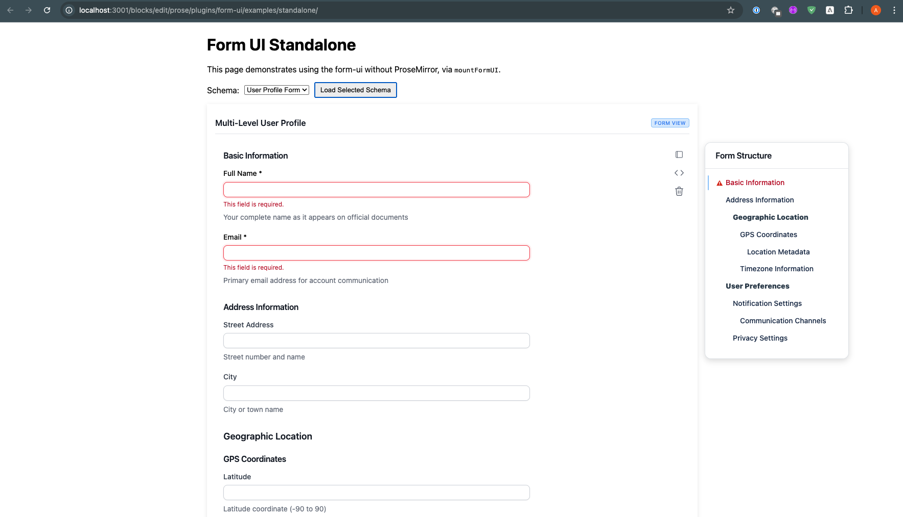

# Form UI – Standalone Usage (no ProseMirror)

This shows how to mount the JSON Schema–driven Form UI on any web page without ProseMirror.

## Minimal Steps

1) Include styles
```html
<link rel="stylesheet" href="../../form-ui.css" />
```

2) Add a mount element
```html
<div id="form-root"></div>
```

3) Mount the form
```html
<script type="module">
  import mountFormUI from '../../core/form-mount.js';

  const schema = { type: 'object', title: 'Example', properties: { name: { type: 'string' } } };
  const data = { name: '' };

  const api = mountFormUI({
    mount: document.getElementById('form-root'),
    schema,
    data,
    onChange(next) { console.log('data changed', next); },
    onRemove() { /* custom delete handling */ },
  });
</script>
```

## Factory API
```js
api.updateData(nextData);
api.updateSchema(nextSchema);
api.toggleRawMode(true);
api.navigateTo(groupId);
api.getData();
api.destroy();
```

## Dynamic Schemas (via loader)
```js
import schemaLoader from '../../utils/schema-loader.js';
import { discoverSchemasPlain, loadSchemaWithDefaults } from '../../commands/form-commands.js';

schemaLoader.configure({ owner: 'kozmaadrian', repo: 'mhast-demo', ref: 'main', basePath: 'forms/' });
const items = await discoverSchemasPlain(); // → [{ id, name }]
const { schema, initialData } = await loadSchemaWithDefaults(items[0].id);
api.updateSchema(schema);
api.updateData(initialData);
```

## Run Locally
```bash
PORT=3001 node server.mjs
# then open the URL printed by the server
```

## Preview



## Notes
- Standalone mode uses a UI‑only `<pre><code>` for raw JSON (created by the factory).
- In ProseMirror, the real code block is an editor node; the factory's `<pre><code>` is only a raw view while `FormNodeView` writes changes back via transactions.
